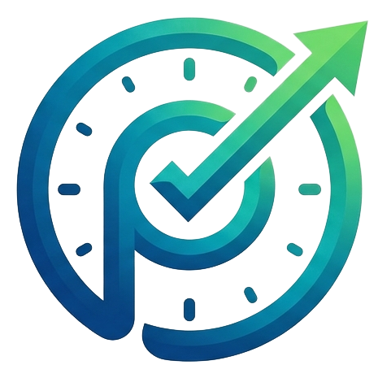
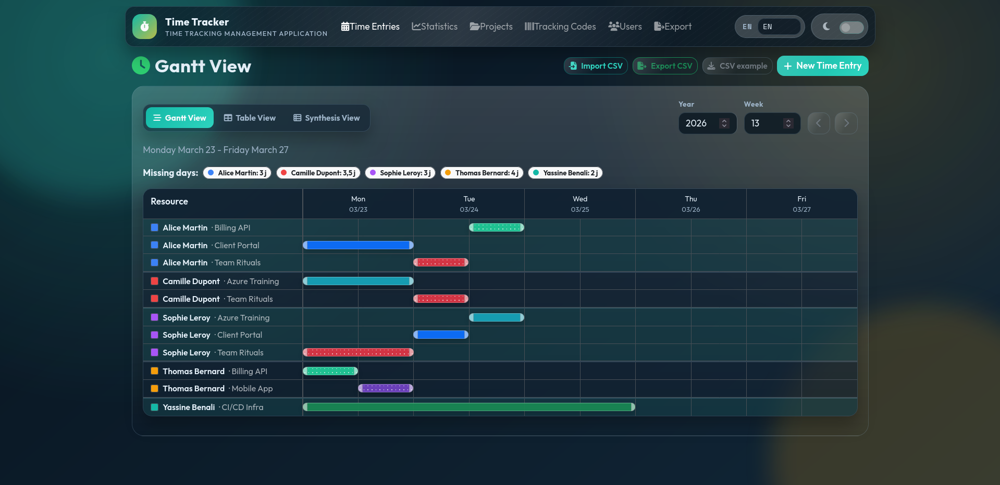
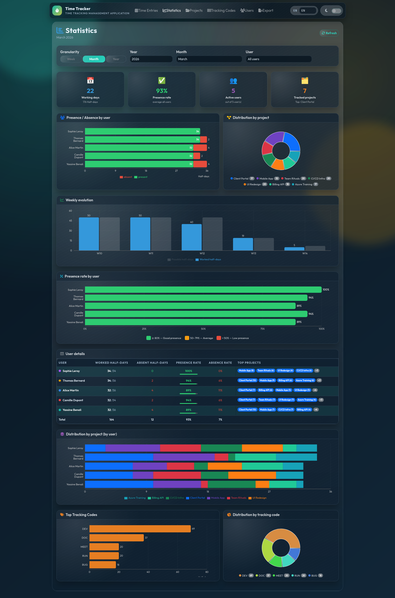
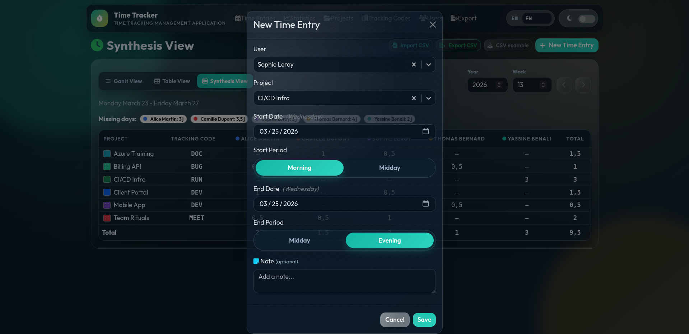
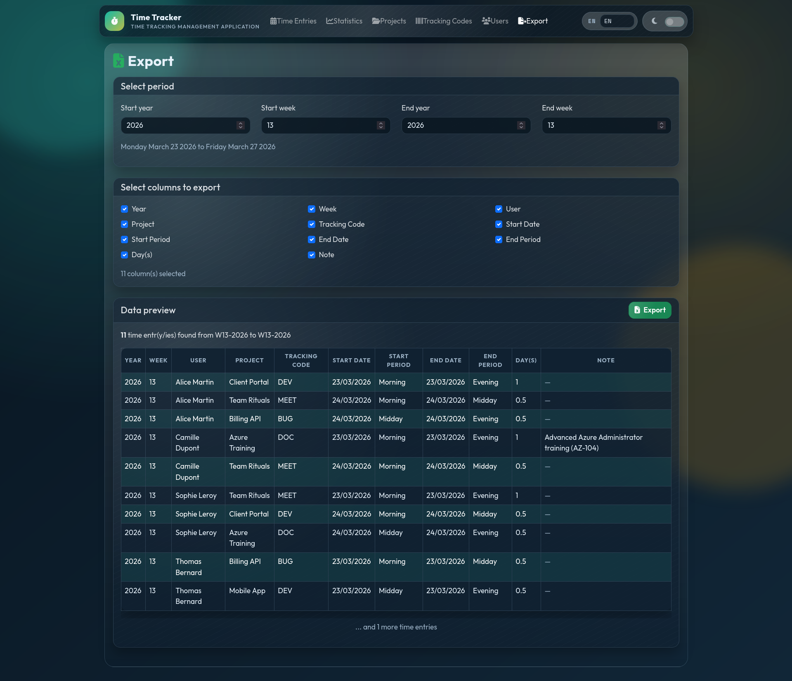

# Time Tracking Application

<p align="center">
	
</p>


[](LICENSE)

A web application for time tracking management, built to replace Excel pivot tables.

## Technologies

- **Backend**: Flask (Python) + SQLAlchemy + MariaDB
- **Frontend**: React + Bootstrap + React Router
- **Infrastructure**: Docker + Docker Compose

## Architecture

### Data Model

1. **TrackingCode**: Unique tracking code (128 characters)
2. **Project**: Unique project name, linked to a tracking code (many-to-one relationship)
3. **User**: Name, identification color, future OIDC support
4. **TimeEntry**: Time entry with number of days, week number, year, user, and project

## Quick Start

Installation and development details are available in the dedicated documentation:

- [Development Guide](docs/README_DEV.md)

### Development

To start quickly in development mode:

```bash
docker compose -f compose.dev.yml up --build --watch
```

Available services:
- **Frontend**: http://localhost:3000
- **Backend API**: http://localhost:5000
- **MariaDB**: localhost:3306

### Production

1. Prepare the environment file:

```bash
cp .env.example .env
```

2. Update the production secrets/values in `.env` (at minimum `MYSQL_*` and `SECRET_KEY`).

3. Start the production stack:

```bash
docker compose -f compose.yml up -d --build
```

4. Access the application:

- **Frontend (Nginx)**: http://localhost
- **API via frontend**: http://localhost/api/v1

To stop:

```bash
docker compose -f compose.yml down
```

Technical documentation (project structure + REST API): [docs/README_DEV.md](docs/README_DEV.md).

## Screenshots

### Gantt View



### Statistics



### New Entry



### Export



## Features

### Tracking Codes
- Create, edit, and delete tracking codes
- Unique code, up to 128 characters
- Protected from deletion if projects are using the code

### Projects
- Manage projects with a unique name
- Required association to a tracking code
- Protected from deletion if time entries exist

### Users
- Manage users with name and color
- Visual color picker (hexadecimal format #RRGGBB)
- Planned OIDC support (`sub` field, nullable)
- Protected from deletion if time entries exist

### Time Entries
- Time entry per user and project
- Half-day support (decimals: 0.5, 2.5, etc.)
- ISO week number (1–53)
- Reference year
- Filtering by year and week
- Uniqueness constraint: one entry per user/project/week/year
- Spreadsheet-style interface for fast entry

### CSV Import / Export
- CSV import for **Users**, **Tracking Codes**, **Projects**, and **Time Entries**
- CSV export for **Users**, **Tracking Codes**, **Projects**, and **Time Entries**
- Sample CSV files downloadable from the interface:
	- `/examples/users_example.csv`
	- `/examples/tracking_codes_example.csv`
	- `/examples/projects_example.csv`
	- `/examples/time_entries_example.csv`

## Development

All development documentation (setup, seed, local execution, type-checking, technical notes) is available in [docs/README_DEV.md](docs/README_DEV.md).

## Future Improvements

- [ ] Add a full DB export/import feature
- [ ] OIDC authentication
- [ ] User permissions management
- [ ] Soft delete for history tracking
- [ ] Full-text search API
- [ ] Notifications and reminders

## License

Distributed under the MIT license. See [LICENSE](LICENSE).
